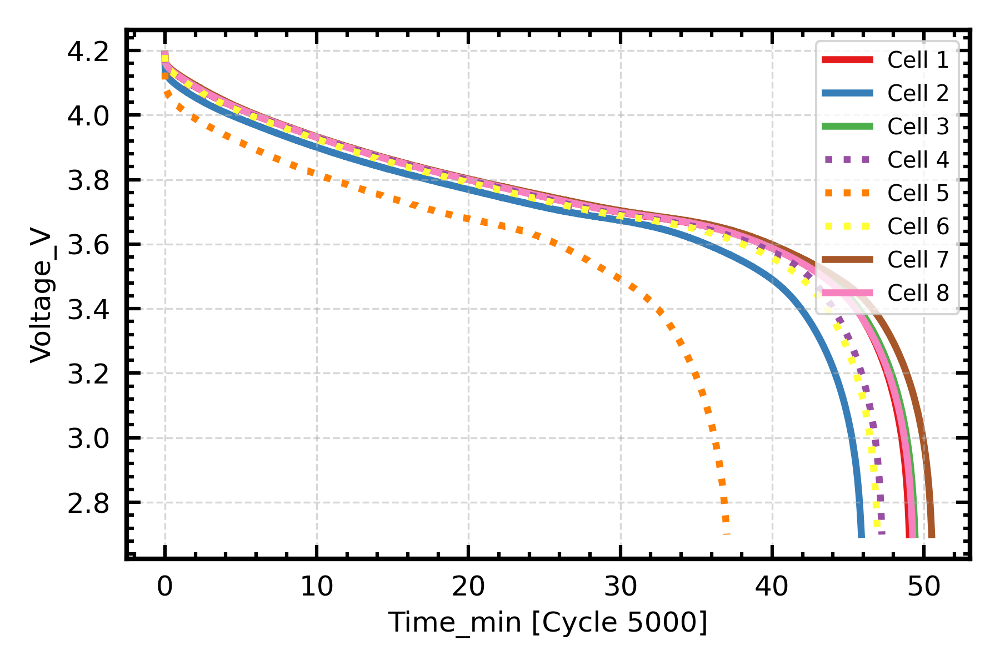
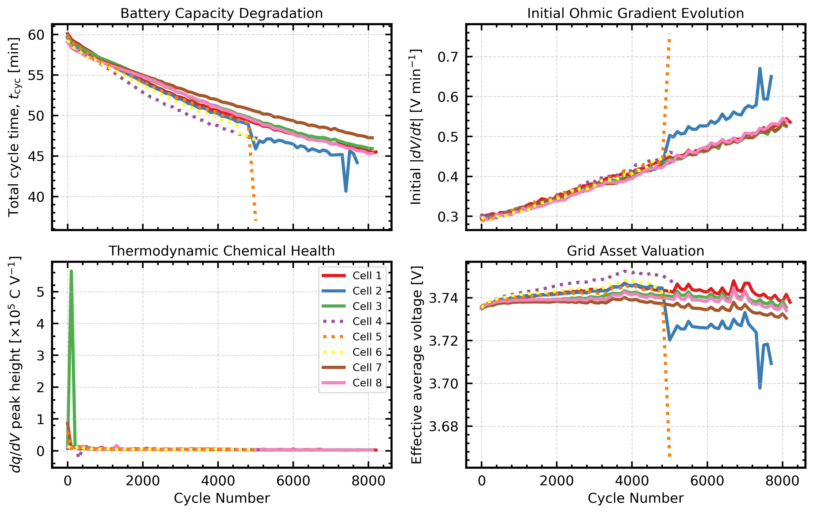
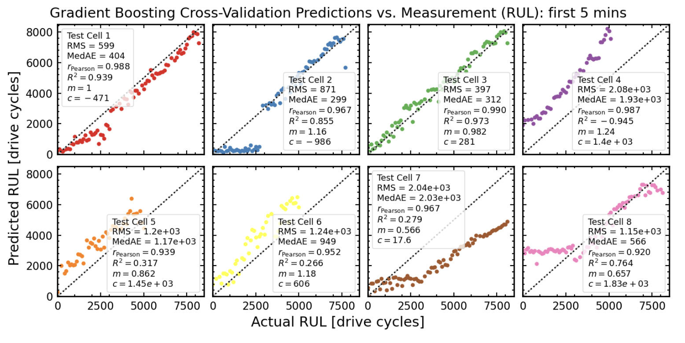

# Machine Learning for Lithium-Ion Battery Health Estimation

Battery prognostics is an active research area underpinning electric vehicles, grid storage and predictive maintenance. Accurate estimation of *State of Health* (SOH) and *Remaining Useful Life* (RUL) enables improved maintenance planning, safer battery operation and more efficient use of battery assets. This project investigates whether these quantities can be estimated from only the first few minutes of a diagnostic discharge.

	    	  MATLAB
      			↓
		  Exploration        		
				↓
	  Feature engineering
        		↓
		 Machine Learning
        		↓
	    SOH • RUL • t_cyc

Using [The Oxford Battery Degradation Dataset](https://ora.ox.ac.uk/objects/uuid:03ba4b01-cfed-46d3-9b1a-7d4a7bdf6fac), the project develops a complete machine learning workflow—from raw data extraction and feature engineering through to predictive modelling and rigorous model evaluation—to investigate three battery prognostic tasks:

- **Discharge duration**
- **State of Health (SOH)**
- **Remaining Useful Life (RUL)**

Rather than simply maximising prediction accuracy, the emphasis is on physically meaningful feature engineering, honest validation, and interpretable model evaluation.

## Motivation

Lithium-ion batteries degrade gradually through mechanisms such as:

- Solid Electrolyte Interphase (SEI) growth
- Loss of active lithium
- Electrode degradation
- Increasing internal resistance

These processes subtly alter the battery's electrical and thermal response long before failure occurs.

The central question explored throughout this project is:

**Can these early changes be detected from only the first few minutes of a diagnostic discharge?**

If successful, this could enable battery health assessment without waiting for a complete discharge cycle.

##Repository Structure

	notebooks/
		01_dataset_extraction.ipynb
   			Read and interpret the Oxford MATLAB dataset
    		Export a clean CSV representation

		02_exploratory_analysis.ipynb
    		Explore degradation behaviour
    		Compare cells
    		Visualise voltage, charge and temperature evolution

		03_feature_engineering.ipynb
    		Extract physically-inspired features
    		Investigate degradation signatures
    		Build a machine learning feature matrix

		04_predictive_modelling.ipynb
    		Predict discharge duration
    		Predict State of Health
    		Predict Remaining Useful Life
    	E	valuate multiple machine learning models
    
    	src/
    		loader.py
    		plotting.py
    
    	data/
    		Oxford_Battery_Degradation_Dataset_1.mat
		

    
     	
## Dataset

The project uses the publicly available [The Oxford Battery Degradation Dataset](https://ora.ox.ac.uk/objects/uuid:03ba4b01-cfed-46d3-9b1a-7d4a7bdf6fac)  developed by the University of Oxford.

The dataset contains:

- 8 lithium-ion pouch cells
- approximately 1.6 million measurements
- voltage
- temperature
- discharged capacity
- repeated characterisation cycles performed approximately every 100 drive cycles

The notebooks convert these raw time-series measurements into one observation per diagnostic cycle suitable for machine learning.
	
  

## Feature Engineering

Rather than feeding the complete discharge curves directly into the models, each diagnostic cycle is summarised using a set of physically meaningful descriptors extracted from the first few minutes of discharge.

Examples include:

- Voltage statistics
- Voltage gradient
- Voltage curvature
- Time-integrated voltage
- Temperature statistics
- Temperature gradient

Observation windows from 1 to 30 minutes are investigated to determine how much information is required before useful predictions become possible.

## Prediction Tasks

Three prediction targets are investigated.

### Discharge Duration (t_cyc)

Estimate the total duration of the current discharge cycle using only the first few minutes of data.

### State of Health (SOH)

Estimate the battery's current health, expressed as the fraction of its initial discharge capacity (approximated using discharge duration under constant-current conditions).

### Remaining Useful Life (RUL)

Estimate the remaining number of drive cycles until the battery reaches the final recorded characterisation cycle.

## Machine Learning

The following regression models are compared:

- Dummy Regressor
- Linear Regression
- Ridge Regression
- Random Forest
- Histogram Gradient Boosting

Performance is evaluated using

- RMSE
- MedAE
- Pearson correlation coefficient
- coefficient of determination (R²)
- calibration slope
- calibration intercept

## Validation Strategy

Battery degradation data present an important machine learning challenge.

A conventional random train/test split allows measurements from the same battery to appear in both training and testing data. Because neighbouring cycles are highly correlated, this leads to trajectory leakage, producing overly optimistic estimates of model performance.

Instead, this project evaluates every model using Leave-One-Group-Out (LOGO) cross-validation, where each battery is treated as a completely unseen test case.

This answers the practical engineering question:

**Can a model trained on existing batteries generalise to a battery it has never seen before?**

## Key Findings

- Early-discharge voltage and temperature measurements contain sufficient information to estimate current battery condition with high accuracy.

- Random Forest and Histogram Gradient Boosting consistently outperform linear regression models.

- State of Health can be estimated accurately from only a short observation window.

- Remaining Useful Life is substantially more difficult because it depends on the battery's future degradation trajectory rather than only its current condition.

- Increasing the observation window beyond approximately five minutes provides surprisingly little additional predictive information for this dataset.

- Rigorous validation is essential; random train/test splits substantially overestimate predictive performance for battery degradation datasets.

## Technologies
- Python
- NumPy
- Pandas
- SciPy
- scikit-learn
- Matplotlib
- Jupyter Notebook

##Skills Demonstrated

- Machine Learning
- Time-series feature engineering
- Battery degradation analytics
- State of Health estimation
- Remaining Useful Life prediction
- Statistical analysis
- Cross-validation methodology
- Scientific Python
- Data visualisation
- Technical communication

## Limitations

This study should be regarded as a proof of concept.

The Oxford dataset contains only eight batteries, limiting the complexity of models that can be trained and increasing uncertainty in Remaining Useful Life predictions.

In addition, diagnostic measurements are only available approximately every 100 drive cycles, meaning the models estimate battery health at periodic characterisation points rather than continuously throughout battery operation.

## Future Work

Possible extensions include:

- Validation using larger industrial battery datasets
- Sequence models (LSTM or Transformer architectures)
- Physics-informed machine learning
- Uncertainty estimation and confidence intervals
- Transfer learning across battery chemistries
- Integration of charging-cycle and impedance measurements
- Battery anomaly detection

## About

This repository was developed as a technical portfolio project demonstrating the application of data science and machine learning to battery prognostics.

The emphasis is on interpretable feature engineering, rigorous evaluation, and reproducible scientific workflows, rather than solely maximising predictive accuracy.
 
 
